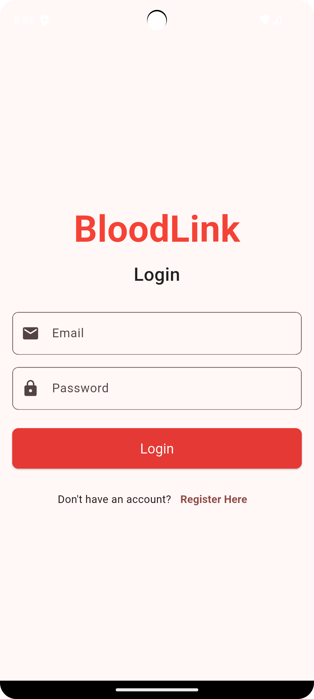
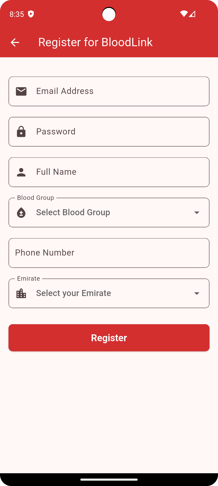
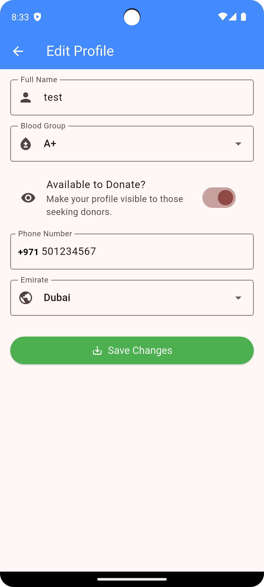
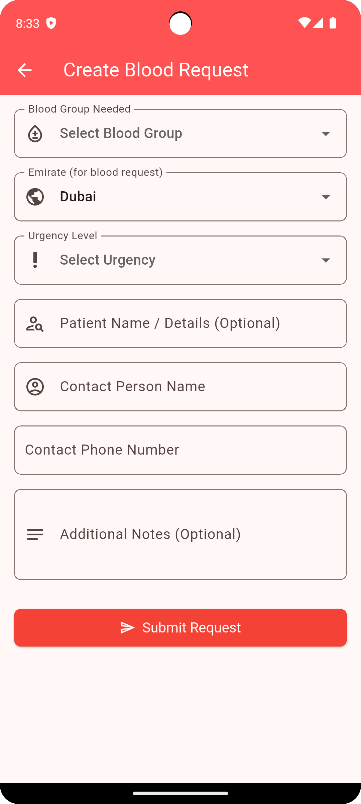
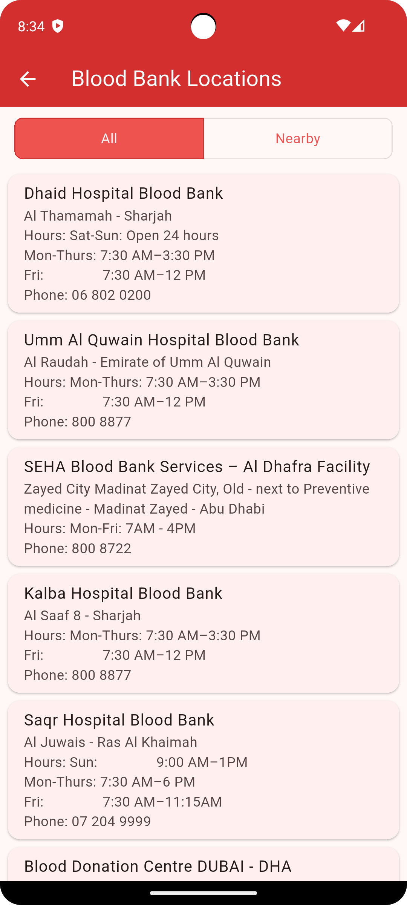

# 📱 BloodLink – Connecting Donors, Saving Lives

**BloodLink** is a real-time mobile app designed to connect blood donors, recipients, and blood banks in the UAE. Built using Flutter and Firebase, the app helps users easily request blood, find nearby donors, and locate blood banks with Google Maps integration.

---

## 🚀 Key Features

- 🔐 **Firebase Authentication** for secure sign-in & sign-up  
- 📝 Validated registration (e.g., phone number cannot start with `0` after +971)  
- 🏠 Home page access to:
  - Request Blood
  - Find Donors
  - My Submitted Requests
  - View Active Requests
  - Locate Blood Banks
- 👤 Editable profile synced to Firestore  
- 🩸 Create blood requests with urgency levels:
  - Urgent
  - Within 24 hours
  - Within 3 days
  - Flexible
- 🧭 Donor filtering (All / Nearby)  
- 📍 Google Maps integration to show exact blood bank locations  
- 🔄 Real-time updates with Firestore

---

## 📸 Screenshots

| Splash Screen | Login Page | Register Page |
|---------------|------------|----------------|
|  |  |  |

| Home Page | Edit Profile | Create Request |
|-----------|--------------|----------------|
|  |  |  |

| Blood Bank Locations |
|----------------------|
|  |

---

## 🛠️ Tech Stack

- **Flutter** – Mobile App Framework  
- **Firebase Authentication** – Secure login  
- **Firebase Firestore** – Realtime cloud database  
- **Google Maps API** – Map & location services  
- **Android Studio** – Development environment

---

## ⚙️ Challenges Overcome

- ✅ Loading data from Firebase in background  
- ✅ Real-time screen updates when new data is added  
- ✅ Ensuring filters (e.g. Nearby donors) work instantly  
- ✅ Handling Google Maps opening and fallback for invalid/missing links

---

## 📲 Download the App

